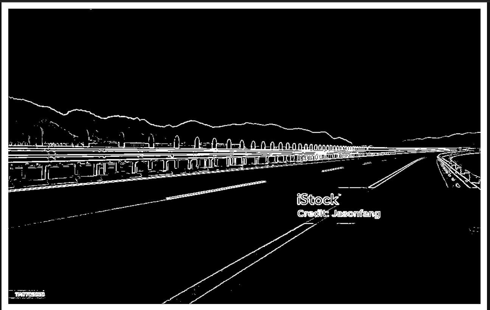

# Image Edge Detection Using Gradient
### A Vector Calculus Approach to Spatial Intensity Analysis

---

## Table of Contents

1. [Overview](#1-overview)
2. [Objective](#2-objective)
3. [Mathematical Formulation](#3-mathematical-formulation)
4. [Working Principle](#4-working-principle)
5. [Methodology](#5-methodology)
6. [Technologies Used](#6-technologies-used)
7. [Input & Output](#7-input--output)
8. [How to Run](#8-how-to-run)
9. [Results](#9-results)
10. [Applications](#10-applications)
11. [Conclusion](#11-conclusion)

---

## 1. Overview

This project demonstrates **edge detection in digital images** using core concepts from **vector calculus**. An image is mathematically modeled as a scalar field `I(x, y)`, where edges are identified by analyzing spatial variations in pixel intensity.

---

## 2. Objective

To detect edges in an image by:
- Computing the **gradient magnitude** of pixel intensity values
- Identifying regions with **high spatial variation**
- Producing a clean binary edge map via thresholding

---

## 3. Mathematical Formulation

### Image as a Scalar Field

An image is represented as a two-dimensional scalar field:

$$I(x,\ y)$$

where each point `(x, y)` maps to a pixel intensity value.

---

### Gradient of the Image

The gradient vector captures the rate of intensity change in both spatial directions:

$$\nabla I = \left(\frac{\partial I}{\partial x},\ \frac{\partial I}{\partial y}\right)$$

| Component | Description |
|---|---|
| `∂I/∂x` | Rate of intensity change in the **horizontal** direction |
| `∂I/∂y` | Rate of intensity change in the **vertical** direction |

---

### Gradient Magnitude (Edge Strength)

The magnitude of the gradient vector quantifies edge strength at each pixel:

$$|\nabla I| = \sqrt{\left(\frac{\partial I}{\partial x}\right)^2 + \left(\frac{\partial I}{\partial y}\right)^2}$$

Or equivalently, using shorthand notation:

$$|\nabla I| = \sqrt{I_x^2 + I_y^2}$$

---

### Interpretation

| Gradient Magnitude | Region Type |
|---|---|
| **High** `|∇I|` | Strong edge — sharp intensity transition |
| **Low** `|∇I|` | Smooth region — gradual or no intensity change |

---

## 4. Working Principle

The input image is treated as a scalar field where each pixel represents a discrete intensity sample.

```
Input Image (Scalar Field I(x, y))
        │
        ▼
┌─────────────────────────────┐
│  Compute ∂I/∂x  (Sobel X)  │
│  Compute ∂I/∂y  (Sobel Y)  │
└─────────────────────────────┘
        │
        ▼
  |∇I| = √(Ix² + Iy²)
        │
        ▼
  Apply Threshold
        │
        ▼
   Edge Map Output
```

The **Sobel operator** is used to numerically approximate the partial derivatives, and a **threshold** is applied to isolate only significant edges.

---

## 5. Methodology

| Step | Operation |
|---|---|
| 1 | Load the input image |
| 2 | Convert image to **grayscale** |
| 3 | Compute horizontal and vertical gradients using the **Sobel operator** |
| 4 | Calculate **gradient magnitude** `|∇I|` |
| 5 | **Normalize** pixel intensity values to `[0, 255]` |
| 6 | Apply **thresholding** to extract significant edges |
| 7 | Display and save results |

---

## 6. Technologies Used

| Library | Purpose |
|---|---|
| **Python** | Core programming language |
| **OpenCV** | Image loading, grayscale conversion, Sobel filtering |
| **NumPy** | Numerical computation of gradient magnitudes |
| **Matplotlib** | Visualization of input and output images |

---

## 7. Input & Output

### Input Image


### Output — Edge Detection Result



---

## 8. How to Run

### Prerequisites

Ensure Python 3.x is installed on your system.

### Step 1 — Install Dependencies

```bash
pip install opencv-python numpy matplotlib
```

### Step 2 — Launch Jupyter Notebook

```bash
jupyter notebook
```

### Step 3 — Run the Project

1. Open the file: `vector.project.ipynb`
2. Click **Run All Cells** (or use `Shift + Enter` on each cell)
3. Output images will be displayed inline within the notebook

---

## 9. Results

The pipeline generates three outputs:

| Output | Description |
|---|---|
| Original Image | Raw input in grayscale |
| Gradient Magnitude Image | Spatial intensity variation map |
| Final Edge Map | Thresholded binary edge detection output |

> Edges are clearly visible in regions with high intensity variation, confirming accurate gradient-based detection.

---

## 10. Applications

- Object detection and recognition
- Medical imaging analysis (MRI, CT scans)
- Autonomous vehicle navigation
- Image segmentation pipelines
- Feature extraction for computer vision systems

---

## 11. Conclusion

This project demonstrates a practical application of **vector calculus in image processing**. By modeling an image as a scalar field `I(x, y)` and computing its gradient `∇I`, edges can be effectively and efficiently detected.

The gradient magnitude `|∇I|` serves as a reliable indicator of edge strength, and the Sobel-based approximation provides a computationally efficient implementation suitable for real-world use.

This technique forms a **fundamental building block** of modern computer vision and artificial intelligence systems.

---

> **Author:** *(Rampariya Harsh)*  
> **Project:** *(Image Edge Detection Using Gradient )*  
> **Institution:** *(JG University)*
